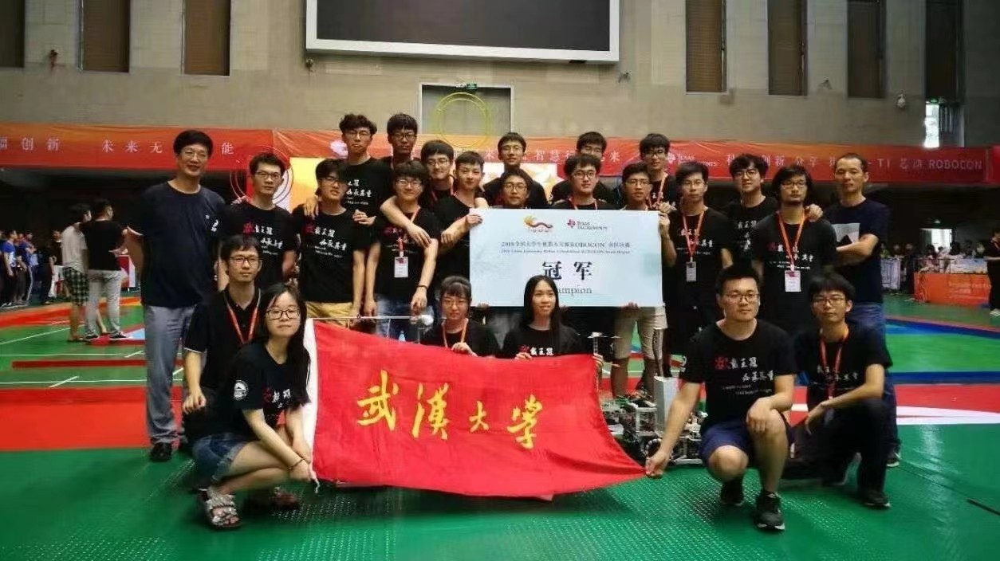
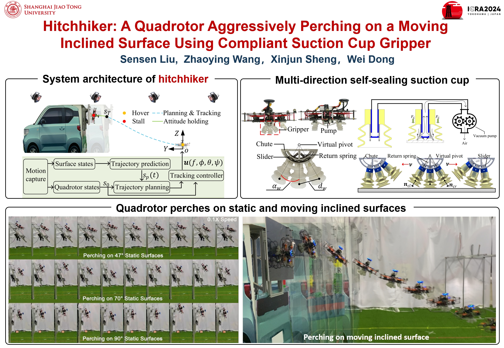
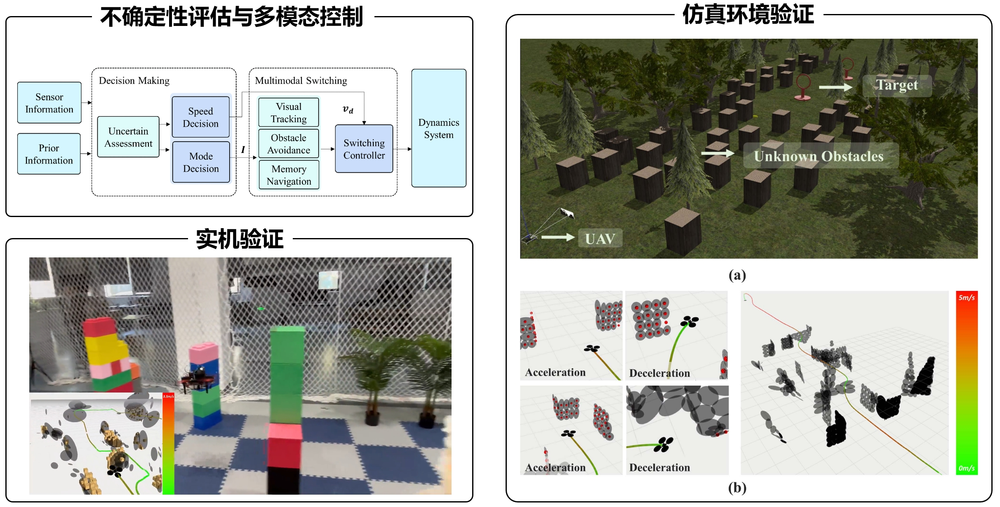

 

# 目录
- [1. 教育背景](#1-教育背景)
- [2. 科研经历概述](#2-科研经历概述)
- [3. 主干科研课题图文](#3-主干科研课题图文)
- [4. 国家级竞赛](#4-国家级竞赛)
- [5. 工程项目](#5-工程项目)
- [6. 合作课题](#6-合作课题)

---
 

# 1-教育背景
---

| 学位 | 学校          | 专业                          | 时间       |
|------|---------------|-------------------------------|------------|
| 博士 | 上海交通大学 **(GPA 排名 前5%)** | 机械工程                      | 2019 - 2025|
| 本科 | 武汉大学 **(GPA 排名 1/133)**    | 机械设计制造及其自动化        | 2015 - 2019 |

<!-- - **博士**  上海交通大学 **(GPA 排名 前5%)**  机械工程                   2019 - 2025
- **本科**  武汉大学 **(GPA 排名 1/133)**     机械设计制造及其自动化      2015 - 2019 -->
---
 

# 2-科研经历概述
---
## 2.1 研究概述
- **研究背景**：在未知复杂城镇环境下，针对单机定位鲁棒性和感知范围不足的问题，致力于构建一个多机紧密协作系统，提升多机协作系统的群体定位鲁棒性与大范围感知建图能力。

- **研究对象**：包含地-空车辆与无人机定位协作系统，以及空-空多无人机感知协作系统（构建动态宽基线立体相机）。

- **研究算法**：
  1. 多机间基于多传感器融合的实时鲁棒相对定位。
  2. 多机视觉特征高精度实时关联。
  3. 多机多视角大尺度地图感知与构建。
  4. 面向多机协同的全向视觉惯性里程计。
  5. 语义视觉惯性里程计与动态地图构建。

## 2.2 竞赛经历
  - 航天三院”如影随形”高速高精准空中对接挑战赛**优胜奖** （第一负责人:无人机硬件设计/视觉识别/伺服控制）
  - 北斗系统“高分”全国无人飞行器智能感知竞赛**冠军**（队长:无人机机械电路设计/视觉识别/飞行策略）
  - 全国大学生机器人竞赛ROBOCON**全国一等奖、南方赛冠军**（硬件组长:电路PCB设计/机械结构设计）

## 2.3 工程项目
  - 振华重工集团港机无人机自主巡检系统开发 (第一负责人: 仿真巡检平台开发/IOS App编写/现场实验交付)
  - 国家电网面向高压线接触式巡检的大型无人机巡检系统 (第一负责人: 轻量化机械结构设计/遥操作控制系统设计/现场实验交付)

## 2.4 合作研究
  - 无人机吸附动态移动车辆 (实时轨迹规划，全向自封闭吸盘设计)
  - 面向环境不确定性建模 无人机多模态控制与模糊决策飞行

## 2.5 学术成果
  - 发表高水平论文7篇，2篇在审。发表包括测量与仪器顶刊 IEEE TIM，机器人高水平期刊 IEEE RAL，自动化顶刊 IEEE TASE, 工业电子顶刊 IEEE TIE。发表机器人领域顶会论文ICRA IROS。另有机器人顶刊 IEEE TRO论文在审小修。
 

---
 

# 3-主干科研课题图文 
---
- ## 3.1 多无人机协作立体相机系统
  使用多架无人机上相机组成宽基线协作立体相机系统，旨在增强系统远距离感知地图能力（**机器人顶会 IROS 2024发表**）
  {:width='768'}
  <!-- <iframe height=406 width=720 src="../images/collaborative-stereo-camera-V2-264-compressed.mp4"> -->
  <video height="406" width="720" controls>
  <source src="../images/collaborative-stereo-camera-V2-264-compressed.mp4" type="video/mp4">
  </video>
 
 

- ## 3.2 多机共视视觉特征实时关联与相对定位
  该工作利用共视环境特征实现多架无人机的实时相对定位。（**机器人高水平期刊 IEEE RAL 2024 小修接收**）
  <!-- <iframe height=406 width=720 src="../images/A-Real-Time-Dual-Channel-Feature-Association-for-Relative-Pose-Estimation-of-UAVs-Only-results-compressed.mp4"> -->
  <video height="406" width="720" controls>
  <source src="../images/A-Real-Time-Dual-Channel-Feature-Association-for-Relative-Pose-Estimation-of-UAVs-Only-results-compressed.mp4" type="video/mp4">
  </video>
 
 

- ## 3.3 基于地空协作系统的鲁棒视觉定位
  针对夜间桥梁底部巡检，提出了一个地空协作视觉定位系统，该工作使用红外-可见光双光源的方案实现无人机相对于车辆的鲁棒视觉估计，以及视觉伺服控制，最终可随车辆引导，完成对桥梁地面的自主巡检。
  （**测量与仪器顶刊 IEEE Transactions on Instrumentation and Measurement 2022 发表**）
  <!-- <iframe height=406 width=720 src="../images/Under-Bridge-Inspection-with-a-Ground-Air-System.mp4"> -->
  <video height="406" width="720" controls>
  <source src="../images/Under-Bridge-Inspection-with-a-Ground-Air-System.mp4" type="video/mp4">
  </video>
 
 
      
- ## 3.4 面向动态环境的语义视觉惯性里程计与粒子占据地图
  面向动态环境下鲁棒自定位和动态地图构建，我们结合语义分割和深度学习视觉特征，基于OpenVINS框架，实现机器人自身定位，并同步构建一个包含动态物体的占据地图。（**机器人顶刊 IEEE TRO 2024 在审小修中**）
  
  <!-- <iframe height=396 width=704 src="../images/semantic-particle-based-map.mp4"> -->
  <video height="396" width="704" controls>
  <source src="../images/semantic-particle-based-map.mp4" type="video/mp4">
  </video>
 
 

- ## 3.5 面向多机协同的全向鱼眼视觉惯性里程计系统
  设计搭建四目鱼眼相机的视觉惯性里程计，为多机协作提供全向观测。
  {:width='768'}
  <!-- <iframe height=396 width=720 src="../images/VIO-omni-fisheye-cameras-H264.mp4"> -->
  <video height="396" width="720" controls>
  <source src="../images/VIO-omni-fisheye-cameras-H264.mp4" type="video/mp4">
  </video>
 
 

---
 
 

# 4-国家级竞赛
---
- ## 4.1 北斗系统“高分”全国无人飞行器智能感知竞赛**冠军**
  赛方要求无人机自主避障并穿越指定竞赛圈，快速抵达终点。**作为领队**提出椭圆拟合，数字识别等关键路标检测方法，带队调试四旋翼无人机。实现无人机以2.5m/s高速穿越复杂密集环境。领先亚军近一倍时间。
  <!-- <iframe height=406 width=720 src="../images/offline.mp4"> -->
  <video height="406" width="720" controls>
  <source src="../images/offline.mp4" type="video/mp4">
  </video>

- ## 4.2 航天三院”如影随形”高速高精准空中对接挑战赛**优胜奖**
  比赛要求无人机高速高精度追踪移动车辆，作为**第一负责人**搭建设计六旋翼无人机，编写视觉识别追踪、视觉伺服控制程序。飞行速度最高达到65km/h。
  <!-- <iframe height=406 width=720 src="../images/high-speed-flight-ruyingsuixing-music-compressed.mp4"> -->
  <video height="406" width="720" controls>
  <source src="../images/high-speed-flight-ruyingsuixing-music-compressed.mp4" type="video/mp4">
  </video>

- ## 4.3 全国大学生机器人竞赛ROBOCON**全国一等奖、南方赛冠军**
  作为硬件组组长，负责电路PCB设计，如主控板、电机驱动板。同时参与轮式机器人机械结构设计与搭建。
  {:width='768'}

---
 
 

# 5-工程项目
---
- ## 5.1 面向高压线X光巡检的柔性拖曳空中巡检机器人
  针对高压线耐张线夹接触式巡检任务，作为**第一负责人**完成全部机械、电控、视觉辅助系统的无人机设计与搭建。国内首次实现无人机带载X光设备精准降落，远程视觉辅助，遥操作控制。成功交付山东国家电网。（**发表在IEEE International Conference on Robotics and Biomimetics 2023**）
  <!-- <iframe height=406 width=720 src="../images/Video-A-Flexible-Towed-Aerial-Robot-System-for-Stable-X-ray-Inspection-of-Power-Lines-compressed.mp4"> -->
  {:width='720'}

  <video height="406" width="720" controls>
  <source src="../images/Video-A-Flexible-Towed-Aerial-Robot-System-for-Stable-X-ray-Inspection-of-Power-Lines-compressed.mp4" type="video/mp4">
  </video>
 
 

- ## 5.2 振华集团港机无人机巡检系统
  基于大疆M300开发港口港机无人机缺陷巡检软件。实现Gazebo虚拟航线规划到实际巡检部署。以**第一负责人**在Rviz中开发巡检示教软件，编写相应IOS港机巡检App。成功交付振华集团所属全球港口自主巡检。（**发表在IEEE International Conference on Real-time Computing and Robotics (RCAR) 2023**）
  {:width='768'}

---
 
 

# 6-合作课题
---

- ## 6.1 搭便车：无人机动态吸附移动车辆
  提出动态多模式搜索策略提升最优时间轨迹规划效率。首次实现无人机实时动态规划与精准末端控制，并设计多角度吸附装置，无人机得以敏捷姿态吸附到移动目标斜面，可提供侦查任务，被IEEE封面高度报道。（**发表在自动化顶刊 IEEE Transactions on Automation Science and Engineering 2023 发表**）
  {:width='720'}
  <!-- <iframe height=396 width=704 src="../images/TASE-hitchhiker-video-music-compressed.mp4"> -->

  <video height="396" width="704" controls>
  <source src="../images/TASE-hitchhiker-video-music-compressed.mp4" type="video/mp4">
  </video>
 
 

- ## 6.2 面向不确定性的无人机多模态控制与模糊决策
  针对无人机在密集环境中飞行模式切换问题，提出环境不确定度评估模型，并建立模糊决策，以最小化不确定性的策略，评估无人机最大飞行速度。设计多种多模态飞行控制策略，实现多种复杂环境下高速安全飞行。
  （**发表在工业电子顶刊 IEEE Transactions on Industrial Electronics 2023**）
  <!-- <iframe height=396 width=704 src="../images/Video-Fast_Flight_of_the_Flying_Robot_With_Fuzzy_Decision_and_Multimodal_Control_Tackling_Uncertainties-compressed.mp4"> -->
  {:width='720'}
  <video height="396" width="704" controls>
  <source src="../images/Video-Fast_Flight_of_the_Flying_Robot_With_Fuzzy_Decision_and_Multimodal_Control_Tackling_Uncertainties-compressed.mp4" type="video/mp4">
  </video>
