 

# 1-教育背景
---

| 学位 | 学校          | 专业                          | 时间       |
|------|---------------|-------------------------------|------------|
| 博士 | 上海交通大学 **(GPA 排名 前5%)** | 机械工程                      | 2019 - 2025|
| 本科 | 武汉大学 **(GPA 排名 1/133)**    | 机械设计制造及其自动化        | 2015 - 2019 |

## 1.1 学术
  - 共发表高水平论文**11篇**，1篇在审，其中一作6篇，二作4篇。在投与发表文章包括机器人顶刊 **IEEE TRO**，测量与仪器顶刊 IEEE TIM，自动化顶刊 IEEE TASE, 工业电子顶刊 IEEE TIE，测量与传感 IEEE Sensor Journal。并发表机器人顶会论文 **ICRA 2024、IROS 2024**。

## 1.2 竞赛
  - 全国大学生机器人竞赛ROBOCON**全国一等奖、南方赛冠军**（**硬件组长**）
  - 北斗“高分”全国无人飞行器智能感知竞赛**冠军**（**队长**）
  - 航天三院“如影随形”高速高精准空中对接挑战赛**优胜奖**（**第一负责人**）

---
 

# 2-科研经历概述
---
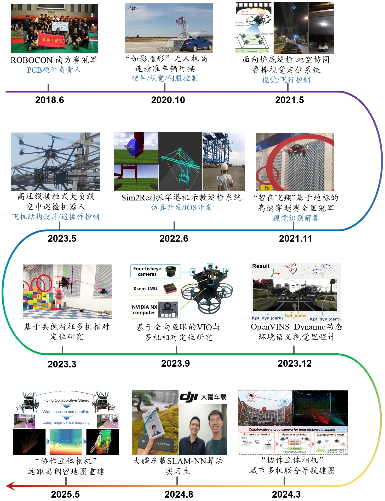{:width='900'}

## 2.1 博士课题研究概述
- **研究背景**：在未知复杂城镇环境下，鉴于单机视觉感知范围不足的问题，致力于构建一个多机紧密协作的宽基线立体相机系统，提升大范围远距离感知建图能力。

- **研究对象**：包含空-空多无人机感知协作系统（构建动态宽基线协作立体相机），以及地-空之间车辆与无人机定位协作系统。

- **研究算法**：
  1. **(定位)** 多机间基于双光谱视觉-IMU-UWB多源融合的实时鲁棒相对定位。
  2. **(特征关联)** 多机基于引导-预测架构的视觉特征高精度实时连续关联。
  3. **(深度估计)** 基于稀疏点深度引导的单目深度网络指数尺度恢复与大尺度地图构建。
  4. **(动态地图)** 语义视觉惯性里程计与动态语义粒子隐式地图构建。
  5. **(全向视觉)** 面向多机协同的全向鱼眼四目视觉惯性里程计。

## 2.2 合作研究
  - **(空中大姿态操作)** 无人机吸附动态移动车辆 (实时轨迹规划，全向自封闭吸盘设计)
  - **(多模态飞行控制)** 面向环境不确定性建模 无人机多模态控制与模糊决策飞行

## 2.3 竞赛经历
  - 全国大学生机器人竞赛ROBOCON**全国一等奖、南方赛冠军**（**硬件组长**:电机驱动板、陀螺仪载板电路PCB设计/机械结构设计）
  - 北斗系统“高分”全国无人飞行器智能感知竞赛**冠军**（**队长**:无人机机械电路设计/视觉识别/飞行策略）
  - 航天三院”如影随形”高速高精准空中对接挑战赛**优胜奖** （**第一负责人**:无人机硬件设计/视觉识别/伺服控制）

## 2.4 工程项目
  - 振华重工集团港机无人机自主巡检系统开发 (**第一负责人**: 仿真巡检平台开发/IOS App编写/现场实验交付)
  - 国家电网面向高压线接触式巡检的大型无人机巡检系统 (**第一负责人**: 轻量化机械结构设计/遥操作控制系统设计/现场实验交付)

 

---
 

# 3-主干科研课题图文 
---

- ## 3.1 Flying Co-Stereo 飞行协作立体相机系统
  两架无人机上相机组成宽基线协作立体相机系统，旨在城市建筑环境中增强系统远距离感知地图能力（**机器人顶刊 IEEE TRO 2025 under review**）
  本课题与MBZUAI左星星老师合作，项目主页：[xingxingzuo.github.io/flying_co_stereo](https://xingxingzuo.github.io/flying_co_stereo/)
  {:width='768'}
  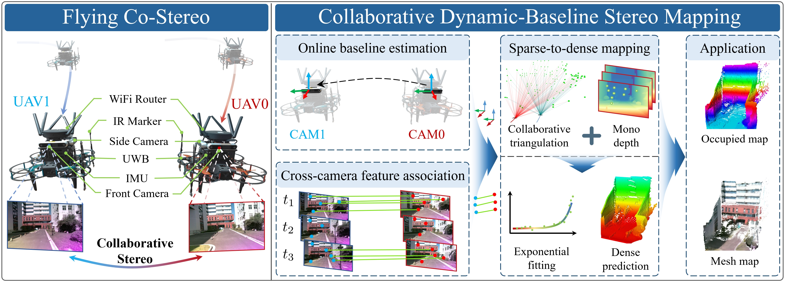{:width='768'}
  <video height="406" width="720" controls>
  <source src="../images/Flying-Co-Stereo-with-music-word-author-university-crf-16.mp4" type="video/mp4">
  </video>
 
 

- ## 3.2 语义增强的协作立体相机系统
  使用两架无人机上相机组成宽基线协作立体相机系统，实现双机在线位姿估计、动态双视角特征关联、最后结合建筑语义轮廓，构建语义轮廓扩展的德劳内三角网格地图，旨在增强系统远距离感知地图能力（**机器人IEEE IROS 2024发表**）
  {:width='768'}
  <!-- 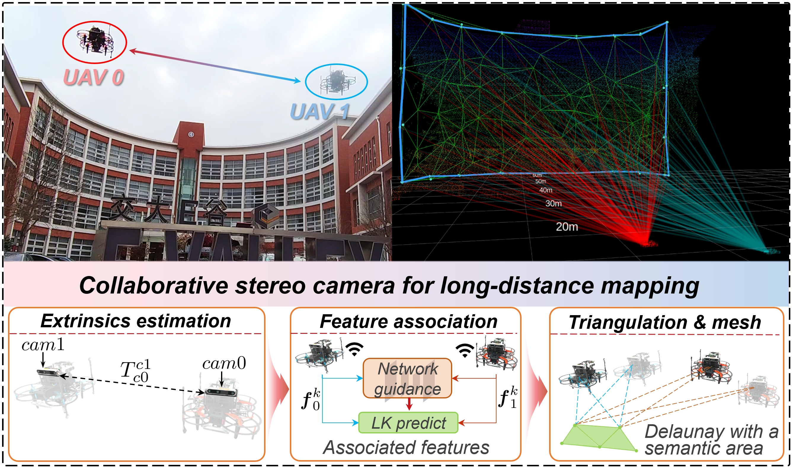{:width='768'} -->
  <video height="406" width="720" controls>
  <source src="../images/collaborative-stereo-camera-V2-264-compressed.mp4" type="video/mp4">
  </video>
 
 

- ## 3.3 变基线协作立体相机系统
  双无人机变基线立体相机系统，突破固定双目基线限制，利用双机空间可变基线实现不同深度场景高精度地图构建（**IEEE Sensors Journal 2025发表**）
  {:width='768'}
  <!-- 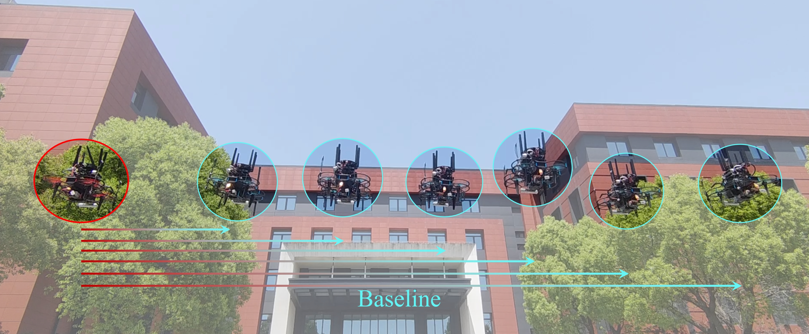{:width='768'}
  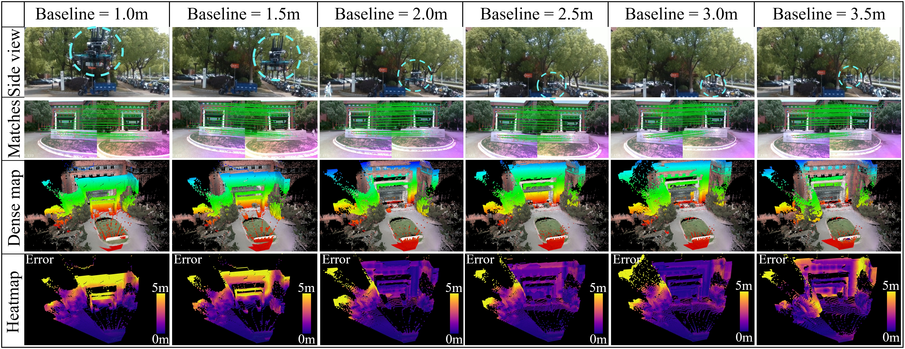{:width='768'} -->
 
 

- ## 3.4 面向动态环境的语义视觉惯性里程计与粒子占据地图
  面向动态车辆、行人环境下传感器噪声、实例分割和跟踪误差以及物体的动态运动这些挑战，本研究结合语义分割和深度学习视觉特征，基于OpenVINS框架，实现机器人自身定位，并提出一种基于语义粒子占据地图，使用具有增强实例状态的粒子来估计物体的概率假设密度（PHD），并对环境进行隐式建模。并可输出一个栅格占据地图用于导航。（**机器人顶刊 IEEE TRO 2024 发表**）Github：https://github.com/tud-amr/semantic_dsp_map 
  <!-- 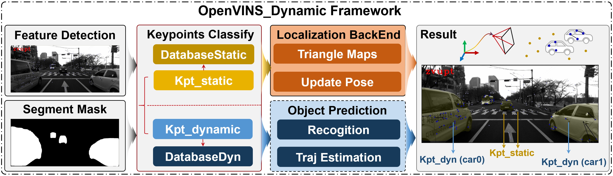 -->
  {:width='768'}
  <!-- <iframe height=396 width=704 src="../images/semantic-particle-based-map.mp4"> -->
  <video height="396" width="704" controls>
  <source src="../images/semantic-particle-based-map.mp4" type="video/mp4">
  </video>
 
 

- ## 3.5 多机共视视觉特征实时关联与相对定位
  面向编队多机相对位姿估计, 本工作重构单机 MSCKF 提出多机 Multi-Rel-MSKCF，以多机 VIO 增量为预
  测，构建相对位姿克隆滑窗，以多机共视环境特征（引导-预测实时连续特征关联）为观测更新。该工作实现了编队无人机实时相对位姿估计，
  还可拓展至多机回环。实时性和准确性优于 PGO 方法（COVINS-G）。并在 EuRoC, VIRAL 数据集上得到验证。（**IEEE Sensors Journal 2025 发表**）
  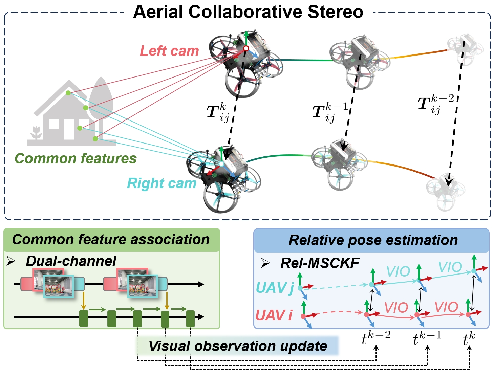{:width='768'}
  {:width='768'}
  <video height="406" width="720" controls>
  <source src="../images/A-Real-Time-Dual-Channel-Feature-Association-for-Relative-Pose-Estimation-of-UAVs-Only-results-compressed.mp4" type="video/mp4">
  </video>
 
 

- ## 3.6 基于地空协作系统的鲁棒视觉定位
  针对夜间桥梁底部巡检，提出了一个地空协作视觉定位系统，该工作使用红外-可见光双光谱投影约束的方案实现无人机相对于车辆的鲁棒视觉估计，以及视觉伺服控制，最终可随车辆引导，完成对桥梁地面的自主巡检。
  （**测量与仪器 IEEE Transactions on Instrumentation and Measurement 2022 发表**）
  <!-- 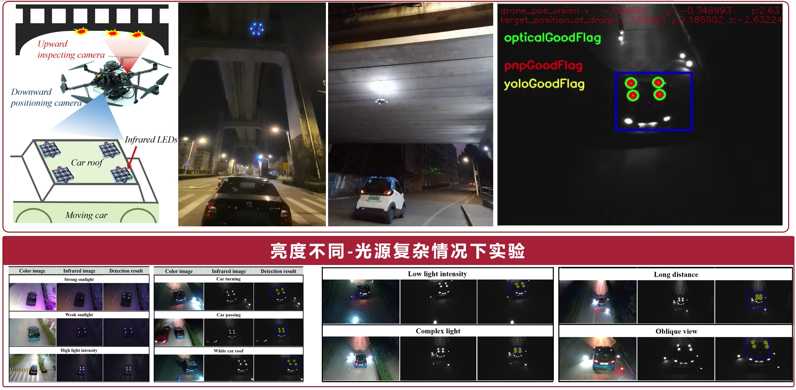{:width='768'} -->
  {:width='768'}
  <video height="406" width="720" controls>
  <source src="../images/Under-Bridge-Inspection-with-a-Ground-Air-System.mp4" type="video/mp4">
  </video>
 
 

- ## 3.7 面向多机协同的全向鱼眼视觉惯性里程计系统
  探索全向视觉SLAM，设计搭建四目鱼眼相机的视觉惯性里程计，为多机协作提供全向观测。
  {:width='768'}
  <!-- 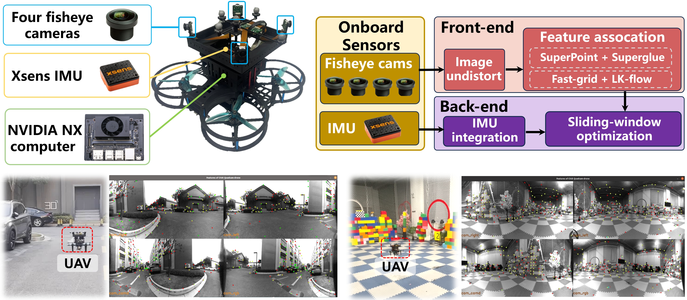{:width='768'} -->
  <!-- <iframe height=396 width=720 src="../images/VIO-omni-fisheye-cameras-H264.mp4"> -->
  <!-- <video height="396" width="720" controls> -->
  <!-- <source src="../images/VIO-omni-fisheye-cameras-H264.mp4" type="video/mp4"> -->
  <!-- </video> -->
 
 

---
 
 

# 4-国家级竞赛
---
- ## 4.1 北斗系统“高分”全国无人飞行器智能感知竞赛**冠军**
  赛方要求无人机自主避障并穿越指定竞赛圈，快速抵达终点。**作为领队**提出椭圆拟合，数字识别等关键路标检测方法，带队调试四旋翼无人机。实现无人机以2.5m/s高速穿越复杂密集环境。领先亚军近一倍时间。
  {:width='768'}

  <!-- <iframe height=406 width=720 src="../images/offline.mp4"> -->
  <!-- <video height="406" width="720" controls> -->
  <!-- <source src="../images/offline.mp4" type="video/mp4"> -->
  <!-- </video> -->

- ## 4.2 航天三院”如影随形”高速高精准空中对接挑战赛**优胜奖**
  比赛要求无人机高速高精度追踪移动车辆，作为**第一负责人**搭建设计六旋翼无人机，编写视觉识别追踪、视觉伺服控制程序。飞行速度最高达到**65km/h**。
  {:width='768'}
  <!-- <iframe height=406 width=720 src="../images/high-speed-flight-ruyingsuixing-music-compressed.mp4"> -->
  <!-- <video height="406" width="720" controls> -->
  <!-- <source src="../images/high-speed-flight-ruyingsuixing-music-compressed.mp4" type="video/mp4"> -->
  <!-- </video> -->

- ## 4.3 全国大学生机器人竞赛ROBOCON**全国一等奖、南方赛冠军**
  作为**硬件组组长**，负责电路PCB设计，如主控板、电机驱动板。同时参与轮式机器人机械结构设计与搭建。
  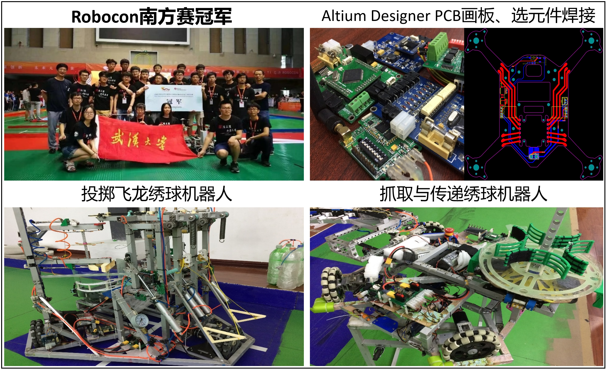{:width='768'}
  {:width='768'}
---
 
 

# 5-工程项目
---
- ## 5.1 面向高压线X光巡检的柔性拖曳空中巡检机器人
  针对高压线耐张线夹接触式巡检任务，作为**第一负责人**完成全部机械、电控、视觉辅助系统的无人机设计与搭建。国内首次实现无人机带载X光设备精准降落，远程视觉辅助，遥操作控制。成功交付山东国家电网。（**发表在IEEE International Conference on Robotics and Biomimetics 2023**）
  <!-- <iframe height=406 width=720 src="../images/Video-A-Flexible-Towed-Aerial-Robot-System-for-Stable-X-ray-Inspection-of-Power-Lines-compressed.mp4"> -->
  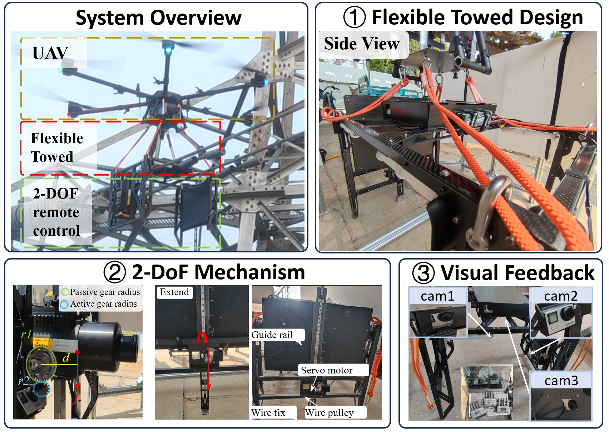{:width='720'}

  <video height="406" width="720" controls>
  <source src="../images/Video-A-Flexible-Towed-Aerial-Robot-System-for-Stable-X-ray-Inspection-of-Power-Lines-compressed.mp4" type="video/mp4">
  </video>
 
 

- ## 5.2 振华集团港机无人机巡检系统
  基于大疆M300开发港口港机无人机缺陷巡检软件。实现Gazebo虚拟航线规划到实际巡检部署。以**第一负责人**在Rviz中开发巡检示教软件，编写相应IOS港机巡检App。成功交付振华集团所属全球港口自主巡检。（**发表在IEEE International Conference on Real-time Computing and Robotics (RCAR) 2023**）
  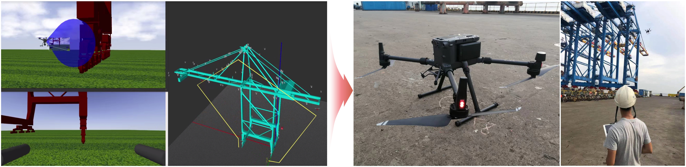{:width='768'}

---
 
 

# 6-合作课题
---

- ## 6.1 搭便车：无人机动态吸附移动车辆
  提出动态多模式搜索策略提升最优时间轨迹规划效率。首次实现无人机实时动态规划与精准末端控制，并设计多角度吸附装置，无人机得以敏捷姿态吸附到移动目标斜面，可提供侦查任务，被IEEE封面高度报道。（**发表在自动化顶刊 IEEE Transactions on Automation Science and Engineering 2023 发表**）
  {:width='720'}
  <!-- <iframe height=396 width=704 src="../images/TASE-hitchhiker-video-music-compressed.mp4"> -->

  <video height="396" width="704" controls>
  <source src="../images/TASE-hitchhiker-video-music-compressed.mp4" type="video/mp4">
  </video>
 
 

- ## 6.2 面向不确定性的无人机多模态控制与模糊决策
  针对无人机在密集环境中飞行模式切换问题，提出环境不确定度评估模型，并建立模糊决策，以最小化不确定性的策略，评估无人机最大飞行速度。设计多种多模态飞行控制策略，实现多种复杂环境下高速安全飞行。
  （**发表在工业电子顶刊 IEEE Transactions on Industrial Electronics 2023**）
  <!-- <iframe height=396 width=704 src="../images/Video-Fast_Flight_of_the_Flying_Robot_With_Fuzzy_Decision_and_Multimodal_Control_Tackling_Uncertainties-compressed.mp4"> -->
  {:width='720'}
  <video height="396" width="704" controls>
  <source src="../images/Video-Fast_Flight_of_the_Flying_Robot_With_Fuzzy_Decision_and_Multimodal_Control_Tackling_Uncertainties-compressed.mp4" type="video/mp4">
  </video>
